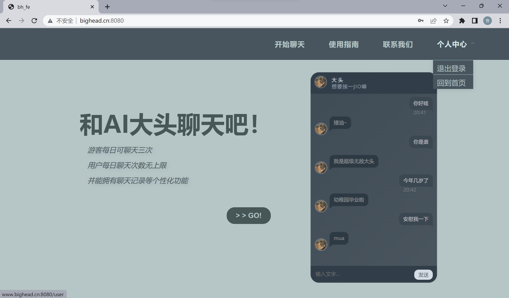
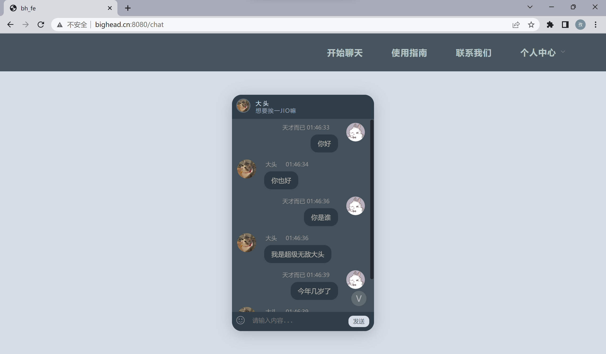
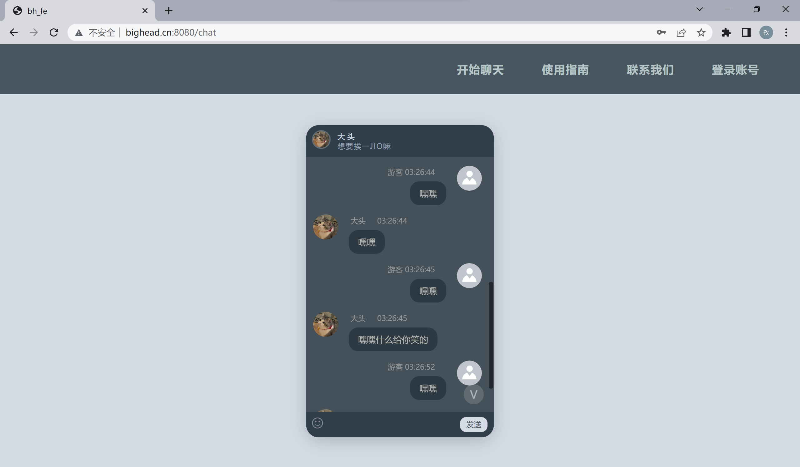
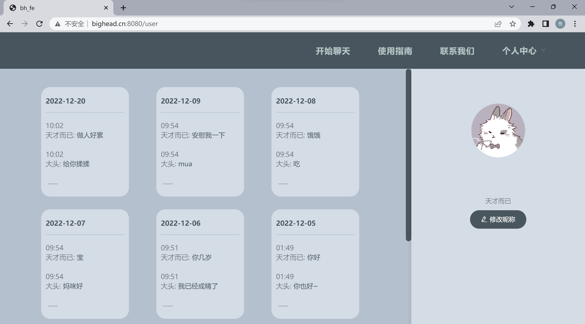
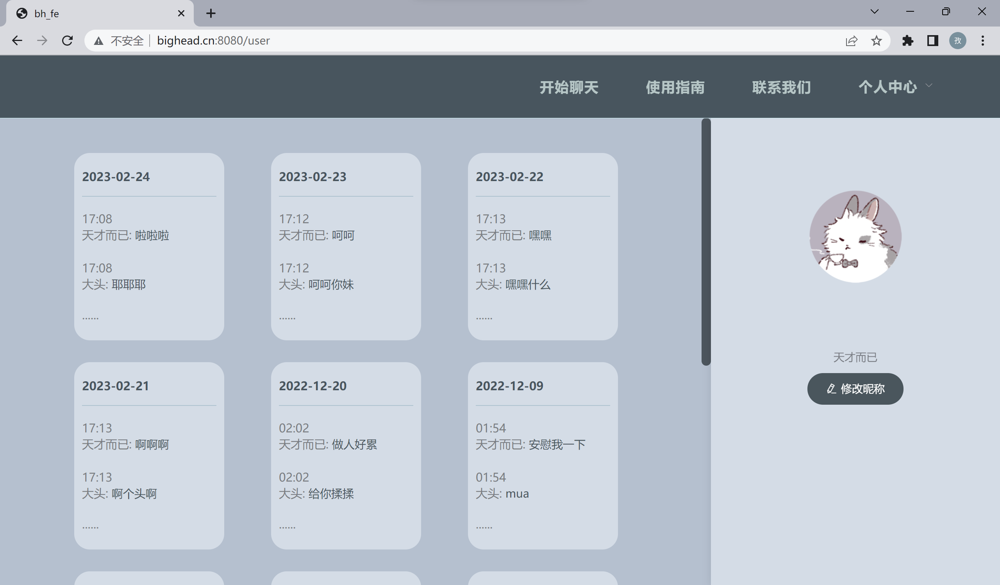

## 闲聊机器人大头
# 1、预览

# 2、技术栈

- os：ubuntu
- 版本控制：git
- 算法框架：pytorch + numpy + jieba 
- 后端框架：django + drf + cors
- 前端框架：vue + elementui + axios
- 异步框架：celery
- 数据库：mysql
- 中间件：redis

# 3、模型架构
seq2seq模型(gru + Bahdanau attention + SGDM)

# 4、实现功能

实现登录认证、注册认证、个人中心、聊天机器、权限限流等功能。

# 5、使用方法

0. 获得data、model.pt

1. 在mysql中，建立数据库bh

2. 在bh_api/settings/dev.py中的DATABASES中，写入mysql配置

3. 设置bh_api为源代码根目录

4. 开启redis

5. 去第三方短信提供商容联云申请账号

   1. 在bh_api/settings/dev.py中配置短信接口

   2. 在bh_api/api/libs/下的sms.py替换手机号、内容格式、模板id

6. 运行bh_api中的manage.py

   
