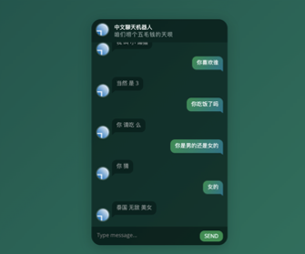
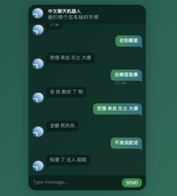

# chatbot

THIS IS BEING USED BY SCAMMERS TO STEAL MONEY!!

ChatGPT带火了聊天机器人，主流的趋势都调整到了GPT类模式，本项目也与时俱进，会在近期更新更新GPT类版本。
这是一个可以使用自己语料进行训练的中文聊天机器人项目，欢迎大家实践交流以及Star、Fork。
# Seq2Seq版本效果参考（训练进度50%）
 
# RoadMap:
V1.1:Update:2024-09-30

1)增加MindSpore版本，优先在MindSpore版本上引入GPT模型，RLHF等特性。

2）整体工程架构分为Seq2Seq和GPT两大分支，继续保持多AI框架版本演进。

V1.2:Update:2024-12-30(Maybe)

1）实现类似mini-GPT4的功能，可以进行图文多模态的对话，主要提升趣味性和丰富性。

2）增强分布式集群训练相关能力和RLHF等特性。

# seq2seq版本代码执行顺序
大家可以使用小黄鸡的语料，下载地址https://github.com/zhaoyingjun/chatbot/blob/master/chineseChatbotWeb-tf2.0/seq2seqChatbot/train_data/xiaohuangji50w_nofenci.conv

1）、在下载好代码和语料之后，将语料文件放入train_data目录下，超参配置在config/seq2seq.ini文件中配置。。

2）、按照数据预处理器（data_utls.py)-->execute.py(执行器)-->app.py（可视化对话模块）的顺序执行就可以了。

3）、大规模分布式训练版本，参照horovod的启动方式 horovodrun -np n -H host1_ip:port,host2_ip:port,hostn_ip:port python3 excute.py
# 建议训练环境配置
ubuntu==18.04  
python==3.6  

TF2.X:

tensorflow==2.6.0

flask==0.11.1

horovod==0.24(分布式训练)

pytorch:

torch==1.11.0

flask==0.11.1

# 开源交流、联系方式
QQ：934389697
